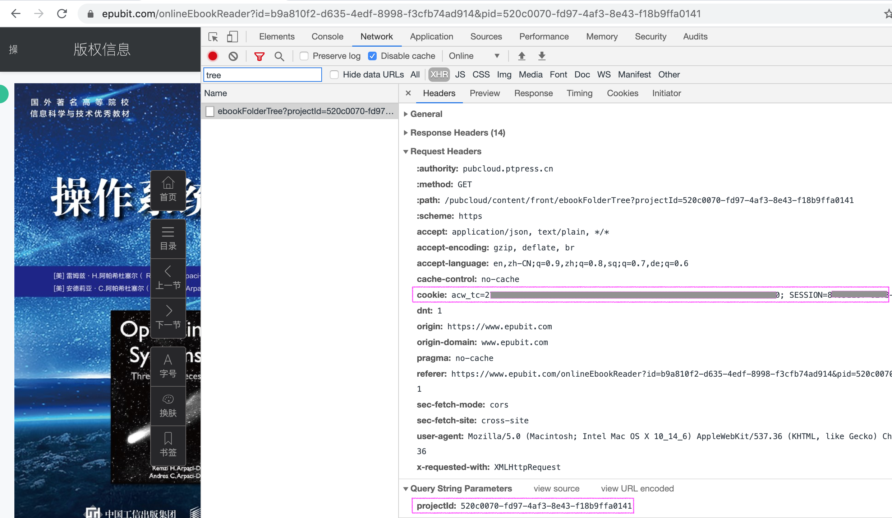
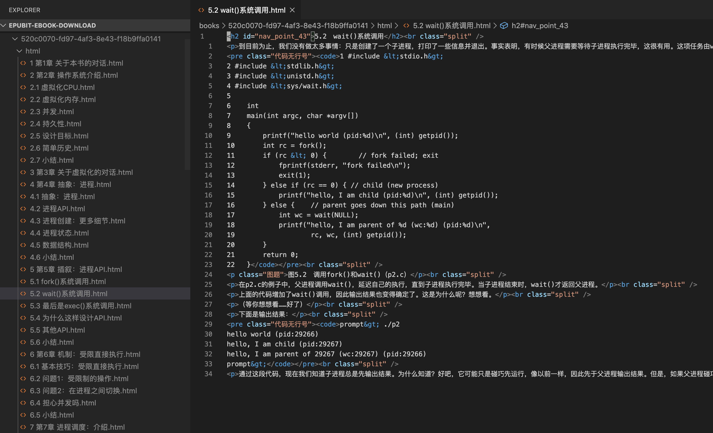

# 异步图书e读版本下载工具

此项目只能用于备份已购买的e读版电子书.

## 下载方法

1. 将本项目clone到本地, 执行 `npm run download`.
2. 进入[异步社区](https://www.epubit.com/)登陆账号, 进入书籍的e读在线阅读页面 ( 必须是已经购买了的书, 比如[《免费示例书籍》](https://www.epubit.com/onlineEbookReader?id=e7c5ba1e-bb9a-4867-a1b2-1ee4e5c74655&pid=9afea4fd-cbc9-4428-860e-e49258d2b0d3) ), 打开浏览器开发者工具, 过滤找到 `/pubcloud/content/front/ebookFolderTree` 请求, 记下请求的 `Cookie` 值和请求参数的 `projectId` 值.

3. 项目根目录执行 `npm start`, 按提示输入步骤2记下的 `Cookie` 和 `projectId`.
4. `logs/` 目录下有下载进度日志, 下载内容会保存到 `books/` 目录.

## 阅读

1. 执行 `npm run reader`, 然后使用浏览器访问 `http://localhost:8002/reader/` 即可.